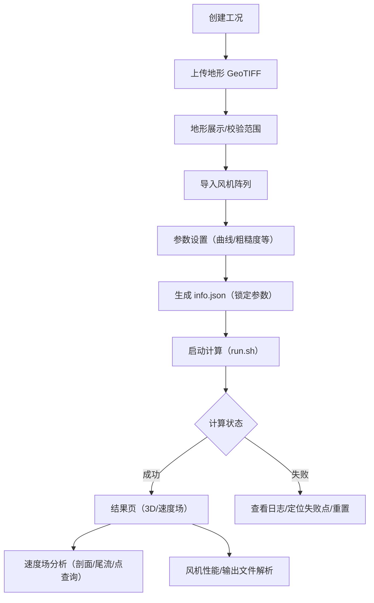

# WindSimProj 平台工作流程审计：完整问题清单与拟修复方向

文档生成日期：2025-12-31  
适用版本：`master@HEAD`（持续更新）  
分析范围：前端（Vue3/Vite/ElementPlus/Pinia）+ 后端（Node/Express/Socket.IO）+ 计算脚本（`backend/base/run.sh`）  

> 目标：从“真实用户工作流”角度列出平台问题清单（含证据位置）与可执行的修复路线图，并结合成熟工况 `backend/uploads/testmi` 的真实 GeoTIFF/rou 数据验证坐标体系与约定。

---

## 0. 问题统计摘要（截至 2025-12-31）

| 优先级 | 数量 | 已修复 | 说明 |
| --- | ---: | ---: | --- |
| P0（阻塞性） | 6 | **6** | ✅ 全部完成 |
| P1（重要） | 12 | **12** | ✅ 全部完成 |
| P2（一般） | 5 | **5** | ✅ 全部完成 |
| **总计** | **23** | **23** | 完成率 ≈ **100%** |

## 1. 真实样本工况验证：`backend/uploads/testmi`

### 1.1 该工况包含的关键文件

- `backend/uploads/testmi/terrain.tif`（地形）
- `backend/uploads/testmi/info.json`（求解器输入核心配置）
- `backend/uploads/testmi/rou`（粗糙度/植被等值线数据，文本）
- `backend/uploads/testmi/customCurves/*.txt`（性能曲线）
- `backend/uploads/testmi/run/*`（OpenFOAM 工况运行目录、时间步、postProcessing 等）

### 1.2 GeoTIFF（terrain.tif）元数据（Python + GDAL 实测）

> 下述数据来自 `rasterio`/`gdalinfo` 对 `backend/uploads/testmi/terrain.tif` 的读取结果（可复现见附录）。

- 文件：`backend/uploads/testmi/terrain.tif`
- Driver：GTiff
- 尺寸：`180 x 162`（band=1，dtype=int16）
- CRS：`EPSG:4326 (WGS84, 经纬度/degree)`
- Pixel Size：`0.00027777777778°`（约 1 arc-second，~30m 级）
- Bounds：
  - `minLon=103.208614`
  - `maxLon=103.258614`
  - `minLat=24.048056`
  - `maxLat=24.093056`
- 高程统计（忽略无效值）：min=1601，max=2079，mean≈1869.97（单位以源数据为准，通常为米）

### 1.3 info.json 与 GeoTIFF 的一致性（已验证）

`backend/uploads/testmi/info.json` 中：

- `geographicBounds` 与 `terrain.tif` 的 bounds 完全一致（数值相同）
- `domain.centerLon/centerLat` 等于 bounds 的中心点：
  - centerLon = `(103.208614 + 103.258614)/2 = 103.233614`
  - centerLat = `(24.048056 + 24.093056)/2 = 24.070556`

> 结论：**成熟工况 `testmi` 的 GeoTIFF 坐标系为 WGS84 经纬度（EPSG:4326），当前前端使用 bbox 当经纬度的做法在该工况上是成立的。**

### 1.4 rou 文件坐标系（UTM）与 lon/lat（WGS84）的关系（已验证）

`backend/uploads/testmi/rou` 文件开头（示例）：

```text
+rou - generated by generate_rou.py
0 0 0 0
0 0 0 0
0 0 0 0
0.000 0.000 3
319861.658 2661789.187
...
```

特征：

- 前 4 行为头部（求解器会跳过）
- “块头”为 3 列：`[任意值] [粗糙度高度/长度] [点数]`
- 后续为 UTM（米制）坐标点：`Easting Northing`

用 `pyproj` 以 `testmi` 的 `windFarmCenter(lon=103.234167, lat=24.075556)` 推断 UTM：

- 推断 UTM Zone：48N
- 风场中心转换到 UTM：E≈320481.152，N≈2663720.429
- rou 采样点范围（抽样 5000 点）：
  - Easting：314821.658 ～ 325261.658
  - Northing：2658459.187 ～ 2668899.187

> 结论：平台/求解器在 **“风机/地形使用经纬度（EPSG:4326）”** 的同时，**rou 文件使用 UTM（米制）坐标**，并在求解器内部用 `LonLat2UTM` 把中心点经纬度转换到同一 UTM 系统，再对 rou 点做窗口过滤与旋转变换（`backend/base/solver/roughFoam/roughFoam.cpp:559` 附近）。

**关键风险点**：
- 只要 GeoTIFF 或风机输入不是 EPSG:4326，经纬度中心不可信 → UTM 推断/转换就会错 → rou 点过滤可能变为“全都不在域内”，最终粗糙度失效或结果错。

---

## 2. 平台总体工作流程（用户视角）



---

## 3. 系统“隐含约定/硬约束”（必须在产品/文档中显式化）

1. **工况名**：后端要求仅字母数字（Joi `alphanum()`），中文/下划线会失败。`backend/routes/cases.js:207`
2. **GeoTIFF 坐标系**：
   - 成熟工况 `testmi` 为 EPSG:4326，经纬度（degree）。
   - 平台当前默认按经纬度处理 bbox 并计算“地理宽高”（haversine）。
   - 若用户提供投影坐标 GeoTIFF（UTM/米制），当前实现会把它当经纬度使用 → 高风险（见问题清单 P1-GeoTIFF）。
3. **粗糙度 rou 文件**：
   - rou 内部为 UTM 坐标（米制），求解器会用中心 lon/lat 推断 UTM 并转换匹配。
   - rou 格式严格（4 行头部 + 多块头 + 点列）。
4. **计算依赖**：
   - 计算启动强依赖 `info.json` 已生成。`backend/routes/cases.js:713`
5. **上传大小限制（后端）**：
   - 创建工况 terrainFile：500MB（multer）。`backend/routes/cases.js:135`
   - DEM 裁切 demFile：100MB（multer）。`backend/routes/demClipper.js:45`
   - roughnessFile：10MB（multer）。`backend/routes/cases.js:191`

---

## 4. 完整问题清单（综合两份文档 + 代码复核 + testmi 数据验证）

> 说明：每条问题都尽量给出【用户现象 → 触发条件 → 根因证据 → 修复方向 → 验收标准】。

### 4.1 P0（阻塞性/高概率误用）

#### ✅ P0-1：caseId 单一来源不成立（串工况/看错工况/写错工况）【已修复】

- 用户现象
  - 直链打开 `/cases/A/results` 可能显示 B 工况数据
  - 多标签页同时打开不同工况时数据串台
  - 刷新后跳回旧工况
- 触发条件：任何 `/cases/:caseId/*` 子页，尤其 Results/速度分析/风机管理
- 根因证据
  - `CaseDetails` 把子组件 `caseId` 绑定到 `caseStore.currentCaseId`（localStorage 恢复值），覆盖路由参数：`frontend/src/views/CaseDetails.vue:18`
  - `currentCaseId` 初始化来自 localStorage：`frontend/src/store/caseStore.js:24`
  - 结果页使用 `caseStore.currentCaseId`：`frontend/src/components/ResultsDisplay.vue:55`
- 修复方向（推荐做法）
  - **路由参数是唯一真源**：CaseDetails 传 `route.params.caseId`
  - 在 CaseDetails（或 router guard）统一 `initializeCase(routeCaseId)`，并在 caseId 变更时重新初始化
  - `currentCaseId` 仅做“最近访问记录”，不再驱动页面数据
- 验收标准
  - 新开标签页/刷新/复制链接访问任何子页，都不会串工况

#### ✅ P0-2：计算失败事件名不一致（失败无提示）【已修复】

- 用户现象：脚本退出码非 0，界面卡住或无错误提示
- 根因证据
  - 后端失败 emit：`calculationFailed`：`backend/routes/cases.js:866`
  - 前端主要监听：`calculationError`：`frontend/src/store/caseStore.js:601`，并且 `CalculationOutput` 也只监听 `calculationError`：`frontend/src/components/CalculationOutput.vue:287`
- 修复方向（最小改动）
  - 前端补监听 `calculationFailed`，统一落到 `calculationStatus='error'` 并展示 `details`
  - 或后端统一 emit 名称（建议后续做“事件常量化”，见路线图）
- 验收标准：任何失败都能在 UI 看见明确错误 + 可复制的详情

#### ✅ P0-3：日志 API 路径不一致（刷新后日志必空）【已修复】

- 用户现象：刷新计算页后，日志面板空白
- 根因证据
  - 前端调用 `/openfoam-output`：`frontend/src/components/CalculationOutput.vue:249`
  - 后端实际提供 `/calculation-log`：`backend/routes/cases.js:1870`
- 修复方向：前端改用 `/api/cases/:caseId/calculation-log`
- 验收标准：刷新页面后仍能读取历史日志内容

#### ✅ P0-4：TaskId 前后端不一致（进度/步骤完全失真）【已修复】

- 用户现象：进度条不动、步骤不更新、无法定位失败点
- 根因证据
  - 前后端 `knownTasks` 使用 `run_admfoam`：`frontend/src/utils/tasks.js:23`
  - 实际脚本输出 `run_roughFoam`：`backend/base/run.sh:210`
  - 后端只对 `knownTasks` 内 taskId 更新进度（未知 taskId 会被忽略）：`backend/routes/cases.js:776`
- 修复方向
  - 以 `run.sh` 的真实 taskId 为准，同步前后端 `knownTasks`
  - 后端不要静默丢弃未知 taskId（至少记录并透传 “unknown task”）
- 验收标准：完整计算过程 UI 步骤与脚本输出一致；失败点落在正确步骤

#### ✅ P0-5：Socket.IO 重复监听（日志重复/状态抖动/泄漏）【已修复】

- 用户现象：同一输出重复出现；多次进出页面后越来越卡；进度抖动
- 根因证据
  - store 内 `connectSocket` 已绑定监听：`frontend/src/store/caseStore.js:584`
  - `CalculationOutput` 又重复绑定同名事件：`frontend/src/components/CalculationOutput.vue:258`
- 修复方向
  - 监听集中在 store；组件只订阅 store 状态
  - store 提供结构化状态（output 列表/任务状态/进度），组件不直接 `socket.on`
- 验收标准：进入/离开页面多次，listener 数不增长，日志不重复

#### ✅ P0-6：生成 info.json 依赖隐式条件（未进地形页就无法提交）【已修复：警告不阻塞】

- 用户现象：用户直接进参数页提交，提示“地理边界尚未加载”
- 根因证据：参数页提交前检查地理边界，但边界只在地形页解析 GeoTIFF 后写入 store：`frontend/src/components/ParameterSettings.vue:756`
- 修复方向
  - 在参数页提供“一键拉取地形 bbox”的 API（后端读取 terrain.tif bbox）或进入参数页时自动拉取 bbox
  - UI 上显式提示“必须先加载地形/或点击获取地形范围”
- 验收标准：用户不进地形页也能完成生成 info.json（或得到明确引导）

---

### 4.2 P1（重要：结果正确性/稳定性/高频踩坑）

#### ✅ P1-1：工况名规则前端未提示/未校验【已修复】

- 根因证据：后端 Joi `alphanum`：`backend/routes/cases.js:207`；前端仅 required：`frontend/src/views/NewCase.vue:142`
- 修复方向：前端表单增加正则/长度提示；UI 明示规则

#### ✅ P1-2：GeoTIFF 坐标系假设过强（投影 GeoTIFF 会严重错位）【已修复：CRS 检测+提示】

- 现状：成熟工况 testmi 为 EPSG:4326，当前实现适配；但系统没有 CRS 检测/分支。
- 风险根因证据
  - 前端直接把 bbox 当 lon/lat：`frontend/src/components/TerrainMap/TerrainMap.vue:1017`
  - store 用经纬度球面公式算宽高：`frontend/src/store/caseStore.js:87`
- 修复方向（建议分阶段）
  - Step1：前端读取 GeoTIFF CRS/GeoKeys，判断是否 geographic/projection，并在 UI 给出明确提示/阻止提交
  - Step2：为 `geographicBounds` 增加 `crs`/`unit` 字段；后端生成 info.json 时做范围校验（经纬度必须在 [-180,180]/[-90,90]）

#### ✅ P1-3：大 GeoTIFF 前端解析性能风险（`Math.min(...arr)`/`Math.max(...arr)`）【已修复】

- 根因证据：`frontend/src/components/TerrainMap/TerrainMap.vue:1050`
- 修复方向：改用循环统计；并考虑后端预计算 min/max 或前端读取时使用 resampling 降采样

#### ✅ P1-4：计算进程缺少取消/超时机制【已修复：支持取消 + 可选超时】

- 根因证据：后端 `spawn` 无超时与 kill API：`backend/routes/cases.js:748`
- 修复说明
  - 新增 `POST /api/cases/:caseId/cancel`：终止运行中的 `run.sh` 进程（支持进程组 SIGTERM→SIGKILL）
  - 可选超时：设置环境变量 `CALCULATION_TIMEOUT_MS`（毫秒）后，超时会自动终止并标记失败
  - 前端计算页新增“取消计算”按钮：`frontend/src/components/CalculationOutput.vue:12`
- 注意
  - 运行进程注册表为**内存级**（后端重启后无法再 cancel 已启动的外部进程；若你需要“重启后也可 cancel”，需要把 pid/pgid 持久化到文件并做守护校验）

#### ✅ P1-5：地形裁切 route 使用 execSync 拼命令（安全/稳健性）【已修复：Joi+spawnSync】

- 根因证据：`backend/routes/terrain.js:185`
- 修复方向：改 `spawn(cmd, args)` + 数值校验 + 白名单路径

#### ✅ P1-6：测风塔事件不一致（无实时进度/结果拉取参数错误）【已修复】

- 根因证据
  - 组件监听 `windmast_progress`：`frontend/src/components/WindMast/WindMastAnalysis.vue:392`
  - 后端只 emit `windmast_analysis_complete`：`backend/routes/windmastRouter.js:185`
  - store complete 后错误传 caseId 拉结果：`frontend/src/store/caseStore.js:622`（`fetchResults` 需要 analysisId：`frontend/src/store/windMastStore.js:100`）
- 修复方向：统一事件名与 payload（必须包含 analysisId）；complete 后用 analysisId 拉结果

#### ✅ P1-7：粗糙度下载页依赖外网瓦片（离线/内网部署无法用）【已修复】

- 根因证据：固定 OSM URL：`frontend/src/views/RouDownloaderPage.vue:20`
- 已实现
  - 瓦片源可配置（构建时 env）：`VITE_LEAFLET_TILE_URL`、`VITE_LEAFLET_TILE_ATTRIBUTION`
  - 提供“地图开/关”开关（无地图模式下仍可直接输入经纬度/半径下载）：`frontend/src/views/RouDownloaderPage.vue`
  - 瓦片加载失败时给出可解释提示（离线/内网可关闭地图或配置内网瓦片服务）

#### ✅ P1-8：rou/DEM 接口参数用 falsy 判断（0 值会被误判缺失）【已修复】

- 根因证据：`backend/routes/rouDownloader.js:49`；`backend/routes/demClipper.js:63`
- 修复方向：改用 `lat == null` / `Number.isFinite` 校验

#### ✅ P1-9：风机路由重复挂载（维护/行为困惑）【已修复：移除重复挂载】

- 根因证据：`backend/app.js:71` 与 `backend/routes/cases.js:2400`
- 修复方向：只保留一处挂载，统一入口

#### ✅ P1-10：存在前端调用但后端不存在的 API（死代码）【已修复：清理无用模块】

- 根因证据：历史代码中存在请求 `/api/map-data` 与 `/api/cases/:caseId/generate-pdf-report`，但后端未实现对应路由
- 已实现
  - 删除未被引用的 store：`frontend/src/store/mapStore.js`
  - 删除未被引用的组件：`frontend/src/components/PDFReportGenerator.vue`
  - 移除结果页的无效 import：`frontend/src/components/ResultsDisplay.vue`

#### ✅ P1-11：粗糙度文件（rou）缺少“上传前结构校验/可视化预览”【已修复】

- 用户现象
  - 用户 rou 文件格式稍有偏差，往往到计算阶段才失败；失败信息对非研发用户不可读
  - UTM 区带不匹配时（例如用户给了别的区带/别的坐标系），粗糙度会被过滤为 0 点，结果“看起来能算但粗糙度没生效”
- 根因证据
  - 前端仅提供格式说明与上传，无解析校验：`frontend/src/components/ParameterSettings.vue:97`
  - 求解器对格式/点数/窗口过滤有硬逻辑：`backend/base/solver/roughFoam/roughFoam.cpp:579`
  - `testmi` 验证显示：rou 为 UTM(米)，而地形/风机是 WGS84，经由 `LonLat2UTM` 对齐（见本文件 1.4）
- 已实现
   - 上传后立即解析并展示摘要（块数/总点数/X-Y 范围/z0 范围 + warnings）：`frontend/src/components/ParameterSettings.vue`
   - 解析失败直接阻止继续使用该文件并提示明确错误（避免“到计算阶段才爆炸”）
   - UTM 范围 sanity check 仅作为 warning（不硬阻塞）
- 验收标准：格式错误能在上传当下给出明确错误；正常文件能展示摘要并提示可能的坐标问题 ✅

#### ✅ P1-12：性能曲线上传缺少“自动一致性校验”（机型/文件/风机模型）【已修复】

- 用户现象
  - 用户上传了曲线文件但命名/列数/单位错误，需要手动点预览才能发现；未预览也可能继续进入计算
  - 不同风机型号（`wind_turbines.json`/`info.json.turbines[].model`）与曲线编号未做自动匹配校验，用户容易配错
- 根因证据
  - 前端有解析能力，但更多用于“点击预览”，不作为强校验门禁：`frontend/src/components/ParameterSettings.vue:589`、`:630`
- 已实现
  - 生成/提交前做强校验门禁：风机模型ID（model/type）必须存在且为纯数字；性能曲线文件名必须为 `<模型ID>-U-P-Ct.txt`；新上传文件必须解析成功；缺失任一机型曲线则阻止提交：`frontend/src/components/ParameterSettings.vue`
  - 后端上传时同步强约束：仅允许 `.txt`，并校验文件名模式（与 `run.sh` 的 `*-U-P-Ct.txt`/`validate_curves` 一致）：`backend/routes/cases.js`
- 验收标准：无法通过校验的曲线不能提交 ✅

---

### 4.3 P2（一般：维护性/一致性/潜在泄漏）

#### ✅ P2-1：速度场组件 resize 监听移除无效（潜在泄漏）【已修复】

- 根因证据：add/remove 使用匿名函数：`frontend/src/components/VelocityFieldDisplay.vue:998`
- 修复方向：保存 handler 引用并正确 remove

#### ✅ P2-2：错误提示/通知风格不统一【已修复：统一 notify 工具】

- 现状：有的用 `ElMessage`，有的只 `console.error`，用户体验碎片化
- 已实现
  - 增加统一通知工具：`frontend/src/utils/notify.js`
  - 在关键链路落地（store/速度场/工况初始化）：`frontend/src/store/caseStore.js`、`frontend/src/components/VelocityFieldDisplay.vue`、`frontend/src/views/CaseDetails.vue`

#### ✅ P2-3：状态持久化策略不清晰（刷新后体验不一致）【已修复：后端权威进度 + 初始化兜底】

- 现状：仅持久化 `currentCaseId`，但计算进度/状态更多依赖 socket
- 已实现
  - 后端持久化计算进度（`calculation_progress.json`）并提供拉取/保存 API（见本文件 P0 修复部分）
  - 前端在 `initializeCase()` 阶段额外拉取持久化进度作为刷新兜底：`frontend/src/store/caseStore.js`

#### ✅ P2-4：结果/速度场大文件加载缺少进度提示与失败可解释性【已修复：下载进度 + 失败提示】

- 用户现象：加载 VTK/VTP 或大切片时，界面长时间无反馈；失败时不清楚是“文件不存在/网络/解析失败”
- 已实现
  - 速度场加载时显示“下载阶段 + 百分比/已下载体积”，失败时给出用户可见错误：`frontend/src/components/VelocityFieldDisplay.vue`

#### ✅ P2-5：运行目录存在 `:Zone.Identifier` 等杂质文件（跨平台/打包困扰）【已修复：运行前清理 + 构建忽略】

- 现象：`backend/uploads/testmi/run/system/*:Zone.Identifier` 等文件存在（Windows 复制产生），可能影响脚本扫描/打包体积
- 已实现
  - 计算准备阶段清理（复制 initcase 后删除）：`backend/base/run.sh`
  - Docker 构建时忽略（避免把杂质带进镜像/增大上下文）：`backend/.dockerignore`、`frontend/.dockerignore`

---

## 5. 修复路线图（建议按依赖关系推进）

### Phase 1（先止血：P0 全部解决）
1. `caseId` 统一：路由为唯一真源；CaseDetails 负责初始化 case；ResultsDisplay 等全部改用 props/route caseId
2. 计算链路对齐：补 `calculationFailed` 监听 + 修日志 API + 同步 taskId
3. Socket 监听集中化：store 统一绑定；组件只消费 store state；禁止组件卸载时断开全局 socket

### Phase 2（正确性：坐标体系/性能/可解释性）
1. GeoTIFF CRS 检测 + UI 提示/阻止错误输入
2. `geographicBounds` 协议升级：增加 `crs`/`unit`，后端生成 info.json 前做强校验
3. TerrainMap 性能：min/max 循环；必要时后端预处理
4. 测风塔事件与结果 ID 全链路统一

### Phase 3（可用性增强 + 清理技术债）
1. 计算取消/超时机制
2. 移除重复挂载与死代码
3. 安全加固：terrain.js execSync → spawn + 校验
4. 可视化组件泄漏点修复

---

## 6. 回归测试清单（按用户实验可直接执行）

### 6.1 caseId 修复验证
1. 创建工况 A 与 B
2. 打开 `/cases/A/parameters`
3. 地址栏直接输入 `/cases/B/results`（不经过列表页）
4. 刷新页面
5. 新标签页打开 `/cases/A/results`

预期：每个页面永远显示对应 URL 的工况数据，不串台。

### 6.2 计算失败提示验证
1. 让脚本必失败（例如删掉 Input 必需文件或人为在脚本中 `exit 1`）
2. 启动计算

预期：前端进入 error 状态，显示失败原因与 details；可在日志中定位。

### 6.3 计算日志持久化验证
1. 完成一次计算（成功或失败）
2. 刷新计算输出页

预期：仍能通过 `/calculation-log` 拉到历史日志。

### 6.4 testmi 坐标体系一致性验证（基准用例）
1. 加载 `testmi` 地形页，确认 bounds 与 info.json 一致
2. 参数页生成 info.json 不应提示缺少地理边界
3. 若上传 `backend/uploads/testmi/rou`，计算不应提示“rou 点全不在域内”

---

## 7. 附录：复现/提取 GeoTIFF 元数据的方法

### 7.1 Python（rasterio）一键查看

```bash
python3 - <<'PY'
import rasterio
from rasterio.enums import Resampling
import numpy as np

path='backend/uploads/testmi/terrain.tif'
with rasterio.open(path) as ds:
    print('crs:', ds.crs)
    print('bounds:', ds.bounds)
    print('res:', ds.res)
    data=ds.read(1, masked=True)
    arr=data.filled(np.nan)
    finite=arr[np.isfinite(arr)]
    print('min/max/mean:', float(finite.min()), float(finite.max()), float(finite.mean()))
PY
```

### 7.2 GDAL（gdalinfo）查看 CRS 与角点

```bash
gdalinfo backend/uploads/testmi/terrain.tif
```

### 7.3 `testmi` 合规输入格式参考（建议用作对外示例）

#### 7.3.1 风机文件（`wind_turbines.json`）

路径：`backend/uploads/testmi/wind_turbines.json`

- 坐标：`longitude/latitude` 为经纬度（WGS84）
- `model` 字段用于与性能曲线文件编号关联（例如 `"1"` → `1-U-P-Ct.txt`）

```json
{
  "name": "S2F01",
  "longitude": 103.245,
  "latitude": 24.06222222222222,
  "hubHeight": 120,
  "rotorDiameter": 116,
  "model": "1"
}
```

#### 7.3.2 性能曲线文件（`customCurves/*-U-P-Ct.txt`）

路径：`backend/uploads/testmi/customCurves/1-U-P-Ct.txt`

- 每行 3 列：`U(m/s)  P(kW)  Ct(-)`（空格/Tab 分隔均可）

```text
3.000  76.700  1.298
3.500  178.610 1.119
4.000  323.830 0.988
...
```

#### 7.3.3 粗糙度文件（`rou`）

路径：`backend/uploads/testmi/rou`

- 前 4 行头部信息（求解器会跳过）
- 块头 3 列：`[任意值] [粗糙度高度/长度] [点数]`
- 后续点为 **UTM（米制）**：`Easting Northing`
