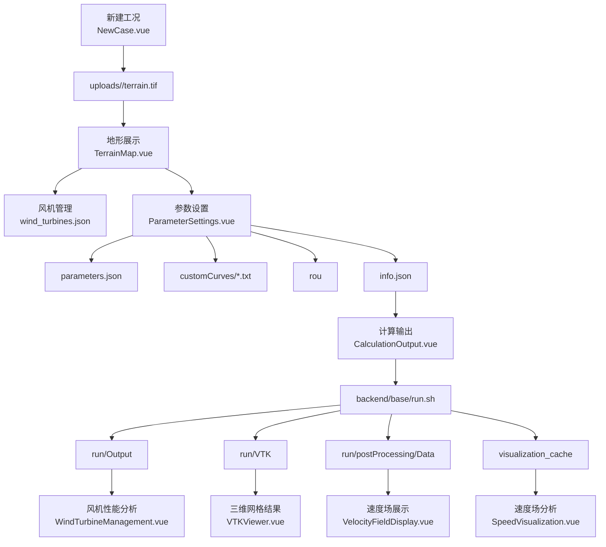

# WindSimProj 全链路分析

## 0. 说明

这份文档基于当前仓库代码整理，目标是把项目的主通路、页面按钮、上传入口、参数含义、后端接口、落盘文件、计算脚本和结果链路全部串起来，便于后续继续排查、重构或补文档。

当前分析范围覆盖：

- 主工况模块：新建工况、地形展示、风机管理、参数设置、计算输出、仿真结果、风机性能分析、速度场分析
- 测风塔模块：文件上传、分析执行、结果列表、结果详情、管理页
- 辅助工具：DEM 获取/裁切、粗糙度文件生成
- 计算脚本：`backend/base/run.sh`

当前 Git 保护点：

- 备份分支：`codex/pre-analysis-backup-20260410`
- 备份提交：`e6788f10 chore: checkpoint terrain workflow changes before full analysis`

## 1. 项目总体结构

### 1.1 技术分层

| 层 | 主要技术 | 作用 |
| --- | --- | --- |
| 前端 UI | Vue 3 + Vite + Pinia + Element Plus | 页面、表单、状态、上传、交互 |
| 三维/图表可视化 | Three.js、VTK.js、Chart.js、Plotly、ECharts、Leaflet | 地形、VTK 网格、速度场、风机性能、测风塔图表 |
| 后端 API | Express + Socket.IO + Multer + gdal-async | 路由编排、文件上传、状态管理、WebSocket 推送 |
| 求解/后处理 | bash + Python + OpenFOAM + GDAL + gmsh | CFD 计算、网格处理、结果采样、可视化缓存生成 |
| 数据持久化 | 文件系统目录 | 工况、参数、曲线、粗糙度、日志、结果、缓存 |

### 1.2 数据核心观念

这个项目的真正“数据库”不是 MySQL/PostgreSQL，而是每个工况对应的目录：

- `backend/uploads/<caseId>/`

一个工况目录通常包含：

- `terrain.tif`：地形原始文件
- `parameters.json`：参数页保存的表单值
- `wind_turbines.json`：风机列表
- `customCurves/`：风机性能曲线文件
- `rou`：粗糙度文件
- `info.json`：求解总配置
- `calculation_progress.json`：计算进度持久化状态
- `run/`：OpenFOAM 运行目录
- `visualization_cache/`：速度场分析预计算缓存

## 2. 主业务全流程



## 3. 前端路由与页面职责

### 3.1 主工况路由

| 路由 | 组件 | 作用 |
| --- | --- | --- |
| `/` | `frontend/src/views/Home.vue` | 首页/介绍页 |
| `/new` | `frontend/src/views/NewCase.vue` | 新建工况 |
| `/cases` | `frontend/src/views/Cases.vue` | 工况列表 |
| `/cases/:caseId/terrain` | `frontend/src/components/TerrainMap/TerrainMap.vue` | 地形展示与风机布置 |
| `/cases/:caseId/parameters` | `frontend/src/components/ParameterSettings.vue` | 参数设置、曲线上传、粗糙度上传、生成 `info.json` |
| `/cases/:caseId/calculation` | `frontend/src/components/CalculationOutput.vue` | 启动计算、查看进度、取消、重置 |
| `/cases/:caseId/results` | `frontend/src/components/ResultsDisplay.vue` | 三维网格和速度场总览 |
| `/cases/:caseId/wind-management` | `frontend/src/components/WindTurbineManagement.vue` | 风机性能输出分析 |
| `/cases/:caseId/speed-visualization` | `frontend/src/components/SpeedVisualization.vue` | 速度场切片、风廓线、尾流、单点查询 |

### 3.2 辅助路由

| 路由 | 组件 | 作用 |
| --- | --- | --- |
| `/terrainClip` | `frontend/src/components/TerrainClippingTester.vue` | DEM 获取/上传/裁切工具 |
| `/rou-downloader` | `frontend/src/views/RouDownloaderPage.vue` | 按经纬度和半径生成粗糙度文件 |
| `/visualization-lab` | `frontend/src/views/VisualizationLab.vue` | 可视化实验页 |
| `/terrainTest`、`/3Dtest`、`/comprehensive-test` | 测试组件 | 调试/实验用途，不属于主业务闭环 |

### 3.3 测风塔模块路由

| 路由 | 组件 | 作用 |
| --- | --- | --- |
| `/windmast` | `WindMastDashboard.vue` | 测风塔概览页 |
| `/windmast/upload` | `WindMastUpload.vue` | 上传 CSV 输入文件 |
| `/windmast/analysis` | `WindMastAnalysis.vue` | 配置并执行分析 |
| `/windmast/results` | `WindMastResults.vue` | 分析结果列表 |
| `/windmast/results/:analysisId` | `WindMastResultDetail.vue` | 单次分析结果详情 |
| `/windmast/management` | `WindMastManagement.vue` | 输入文件、分析记录、存储统计管理 |

## 4. 主工况模块逐页分析

## 4.1 工况列表页 `Cases.vue`

### 页面职责

- 读取工况列表
- 删除工况
- 进入某个工况
- 跳转新建工况页

### 按钮与行为

| 按钮 | 行为 | 后端接口 | 结果 |
| --- | --- | --- | --- |
| `新建工况` | 跳转 `/new` | 无 | 进入创建页 |
| `查看详情` | 跳转 `/cases/:caseId/terrain` | 无 | 进入地形页 |
| `删除` | 删除工况 | `DELETE /api/cases/:caseId` | 删除整个工况目录 |
| 空状态 `创建第一个工况` | 跳转 `/new` | 无 | 进入创建页 |

### 关键数据

- 通过 `GET /api/cases` 获取目录列表
- 前端直接把返回的字符串数组包装成表格数据

## 4.2 新建工况页 `NewCase.vue`

### 页面职责

- 创建一个工况目录
- 上传初始地形文件 `terrain.tif`

### 表单字段

| 字段 | 限制 | 用途 |
| --- | --- | --- |
| `caseName` | 仅字母数字，长度 1-50 | 工况目录名 |
| `terrainFile` | `.tif/.tiff` | 初始地形文件 |

### 按钮与上传

| 控件 | 行为 | 后端接口 | 落盘 |
| --- | --- | --- | --- |
| 地形上传框 | 选择 GeoTIFF | `POST /api/cases` | `uploads/<caseId>/terrain.tif` |
| `创建工况` | 提交表单 | `POST /api/cases` | 创建工况目录并保存地形 |

### 失败条件

- 工况名含非字母数字
- 未上传地形文件
- 文件类型不是 GeoTIFF
- 文件过大或 Multer 处理失败

## 4.3 地形展示页 `TerrainMap.vue`

### 页面职责

- 加载 `terrain.tif`
- 解析 GeoTIFF，建立 Three.js 地形场景
- 显示地形边界和高程信息
- 管理风机的添加、批量导入、删除

### 页面子组件

| 子组件 | 作用 |
| --- | --- |
| `TopToolbar.vue` | 顶部入口按钮 |
| `ControlPanel.vue` | 相机/线框/叶片旋转控制 |
| `WindTurbineManagement.vue` | 风机添加与导入侧栏 |
| `TerrainInfo.vue` | 坐标、高程、比例尺信息 |
| `TurbineTooltip.vue` | 鼠标悬浮提示 |

### 顶部工具栏按钮

| 按钮 | 行为 |
| --- | --- |
| `控制面板` | 打开/关闭左侧控制面板 |
| `风机管理` | 打开/关闭右侧风机管理面板 |
| `新增风机` | 直接打开风机管理侧栏并切到添加状态 |

### 控制面板按钮/开关

| 控件 | 行为 |
| --- | --- |
| `重置相机` | 将相机回到默认视角 |
| `线框` | 切换地形线框显示 |
| `叶片旋转` | 控制风机叶片动画 |
| `旋转速度` | 调整叶片旋转速度 |
| `关闭` | 折叠控制面板 |

### 风机管理侧栏

#### 添加风机页签

手动新增字段：

| 字段 | 含义 |
| --- | --- |
| `name` | 风机名称 |
| `longitude` | 经度 |
| `latitude` | 纬度 |
| `hubHeight` | 轮毂高度 |
| `rotorDiameter` | 叶轮直径 |
| `turbineModelId` | 风机模型 ID，对应性能曲线文件编号 |

手动新增按钮：

| 按钮 | 行为 | 后端接口 | 落盘 |
| --- | --- | --- | --- |
| `添加风机` | 提交单台风机 | `POST /api/cases/:caseId/wind-turbines` | `wind_turbines.json` |

#### 批量导入

上传组件支持：

- 文件类型：`.txt`、`.csv`
- 每行格式：`名称,经度,纬度,高度,直径,模型ID`
- 经纬度支持十进制度数和度分秒

批量导入流程：

1. 前端本地解析文本
2. 校验经纬度/高度/直径/模型ID
3. 过滤掉超出地形边界的风机
4. 调用后端批量保存

对应接口：

- `POST /api/cases/:caseId/wind-turbines/bulk`

#### 风机列表页签

| 操作 | 行为 | 后端接口 |
| --- | --- | --- |
| 删除按钮 | 删除指定风机 | `DELETE /api/cases/:caseId/wind-turbines/:turbineId` |

### 地形加载链路

1. 前端调用 `GET /api/cases/:caseId/terrain`
2. 后端直接流式返回 `terrain.tif`
3. 前端用 `geotiff` 解析 raster、geoTransform、边界范围
4. 前端建立 Three.js 网格、计算高程上下界
5. 前端把地理边界写入 `caseStore.minLatitude/maxLatitude/minLongitude/maxLongitude`

### 地形页的重要事实

- 这个页面不是纯展示页，它同时承担了“边界初始化”的职责
- 参数页生成 `info.json` 时，如果没有地理边界，会退化为使用风机群中心；因此地形页最好先打开一次

## 4.4 参数设置页 `ParameterSettings.vue`

### 页面职责

- 编辑 CFD 相关参数
- 上传粗糙度文件
- 上传风机性能曲线
- 保存 `parameters.json`
- 生成 `info.json`
- 解锁参数（删除 `info.json`）
- 下载 `info.json`

### 表单区块

#### 计算域

| 字段 | 前端字段 | info.json 映射 |
| --- | --- | --- |
| 计算域长度 | `calculationDomain.width` | `domain.lt` |
| 计算域高度 | `calculationDomain.height` | `domain.h` |

#### 工况

| 字段 | 前端字段 | info.json 映射 |
| --- | --- | --- |
| 风向角 | `conditions.windDirection` | `wind.angle` |
| 入口风速 | `conditions.inletWindSpeed` | `wind.speed` |

#### 网格

| UI 字段 | 前端字段 | info.json 映射 |
| --- | --- | --- |
| 粗糙层高度 | `grid.encryptionHeight` | `mesh.h1` |
| 粗糙层层数 | `grid.encryptionLayers` | `mesh.ceng` |
| 纵向网格生长率 | `grid.gridGrowthRate` | `mesh.q1` |
| 最大网格尺寸 | `grid.maxExtensionLength` | `mesh.lc1` |
| 最小网格尺寸 | `grid.encryptionRadialLength` | `mesh.lc2` |
| 尾流区径向长度 | `grid.downstreamRadialLength` | `mesh.lc3` |
| 网格加密区半径（内） | `grid.encryptionRadius` | `mesh.r1` |
| 网格加密区半径（外） | `grid.encryptionTransitionRadius` | `mesh.r2` |
| 地形区域半径（内） | `grid.terrainRadius` | `mesh.tr1` |
| 地形区域半径（外） | `grid.terrainTransitionRadius` | `mesh.tr2` |
| 尾流区加密长度 | `grid.downstreamLength` | `mesh.wakeL` |
| 尾流区加密宽度 | `grid.downstreamWidth` | `mesh.wakeB` |
| 缩尺比 | `grid.scale` | `mesh.scale` |

#### 植被与粗糙度

| 字段 | 前端字段 | info.json 映射 |
| --- | --- | --- |
| 植被拖曳系数 | `roughness.Cd` | `roughness.Cd` |
| 最大叶面积密度 | `roughness.lad_max` | `roughness.lad_max` |
| 植被高度缩放系数 | `roughness.vege_times` | `roughness.vege_times` |

#### 仿真

| 字段 | 前端字段 | info.json 映射 |
| --- | --- | --- |
| 核数 | `simulation.cores` | `simulation.core` |
| 步数 | `simulation.steps` | `simulation.step_count` |
| 时间步长 | `simulation.deltaT` | `simulation.deltaT` |

#### 后处理

| 字段 | 前端字段 | info.json 映射 |
| --- | --- | --- |
| 结果层数 | `postProcessing.resultLayers` | `post.numh` |
| 层数间距 | `postProcessing.layerSpacing` | `post.dh` |
| 结果宽度 | `postProcessing.layerDataWidth` | `post.width` |
| 结果高度 | `postProcessing.layerDataHeight` | `post.height` |

### 粗糙度文件上传

#### 支持格式

- 扩展名：`.txt`、`.dat`、`.rou`
- 文件最终统一保存为 `rou`
- 前端会先读取文本并做结构摘要校验

#### 前端行为

| 操作 | 行为 | 后端接口 |
| --- | --- | --- |
| 选择粗糙度文件 | 本地读取并解析摘要 | 无 |
| 上传粗糙度文件 | 真正提交给后端 | `POST /api/cases/:caseId/roughness-file` |
| 删除服务器已有粗糙度文件 | 删除 `rou` | `DELETE /api/cases/:caseId/roughness-file` |
| 检查已有粗糙度文件 | 读取文件信息 | `GET /api/cases/:caseId/roughness-file-exists` |

#### 落盘位置

- `backend/uploads/<caseId>/rou`

### 性能曲线上传

#### 命名约束

- 文件名必须为：`<模型ID>-U-P-Ct.txt`
- 例如：`1-U-P-Ct.txt`

#### 内容格式

- 三列数值：`风速 功率 推力系数`

#### 前端行为

| 操作 | 行为 | 后端接口 |
| --- | --- | --- |
| 新上传曲线文件 | 前端先解析并画图预览 | 无 |
| 点击已有文件名 | 加载服务器上的文件内容并预览 | `GET /api/cases/:caseId/curve-files/:fileName` |
| 删除已有文件 | 删除曲线文件 | `DELETE /api/cases/:caseId/curve-files/:fileName` |
| 查询服务器已有文件列表 | 加载已有文件元数据 | `GET /api/cases/:caseId/curve-files` |
| 真正上传新文件 | 提交到后端 | `POST /api/cases/:caseId/curve-files` |

#### 落盘位置

- `backend/uploads/<caseId>/customCurves/*.txt`

### 提交按钮

| 按钮 | 行为 | 涉及接口 |
| --- | --- | --- |
| `提交参数` | 校验地理边界、风机曲线、粗糙度；上传文件；保存参数；生成 `info.json` | `POST /roughness-file`、`POST /curve-files`、`POST /parameters`、`POST /info` |
| `修改参数` | 删除 `info.json` 并解锁页面 | `DELETE /api/cases/:caseId/info` |
| `下载 info.json` | 下载总配置 | `GET /api/cases/:caseId/info-download` |

### 生成 `info.json` 的关键逻辑

1. 读取前端表单参数
2. 读取风机列表
3. 尝试优先使用地形边界计算 CFD 域中心
4. 若没有地形边界，则退化为风机群中心
5. 将风机经纬度投影为相对风机群中心的 `x/y`
6. 生成求解器所需的统一配置

### 参数页的几个关键约束

- 有风机时必须存在匹配模型 ID 的性能曲线文件
- 无风机时允许做纯流场仿真
- 无粗糙度文件时允许继续，后端按默认粗糙度路线运行

## 4.5 计算输出页 `CalculationOutput.vue`

### 页面职责

- 启动 CFD 计算
- 展示步骤进度
- 展示终端日志
- 取消/重置计算
- 跳转结果页

### 主要按钮

| 按钮 | 前置条件 | 行为 | 后端接口 |
| --- | --- | --- | --- |
| `开始计算` | `info.json` 已存在 | 启动计算 | `POST /api/cases/:caseId/calculate` |
| `去参数设置` | `info.json` 不存在时显示 | 跳转参数页 | 无 |
| `查看结果` | 计算完成后显示 | 跳转结果页 | 无 |
| `取消计算` | 计算进行中显示 | 请求终止后台子进程 | `POST /api/cases/:caseId/cancel` |
| `重置` | 非运行态显示 | 删除进度文件并把状态重置为未开始 | `DELETE /api/cases/:caseId/calculation-progress` |
| `重试` | 初始化失败时显示 | 重新加载状态和日志 | `GET /calculation-status`、`GET /calculation-progress`、`GET /calculation-log` |

### 页面数据来源

- 计算状态：`GET /api/cases/:caseId/calculation-status`
- 持久化进度：`GET /api/cases/:caseId/calculation-progress`
- 历史日志：`GET /api/cases/:caseId/calculation-log`
- 实时输出：Socket.IO

### WebSocket 事件

| 事件 | 含义 |
| --- | --- |
| `taskUpdate` | 整个步骤状态表更新 |
| `taskStarted` | 某任务开始 |
| `calculationOutput` | 原始日志输出 |
| `calculationProgress` | 总体进度变化 |
| `calculationStarted` | 计算开始 |
| `calculationCompleted` | 计算完成 |
| `calculationFailed` | 计算失败 |
| `calculationCanceled` | 计算取消 |
| `calculationError` | 启动/运行错误 |

## 4.6 结果展示页 `ResultsDisplay.vue`

### 页面职责

- 联合显示三维 VTK 网格和速度场
- 提供导出能力

### 页面区域

| 区域 | 组件 | 数据来源 |
| --- | --- | --- |
| 三维模型 | `VTKViewer.vue` | `run/VTK/processed/*.vtp` |
| 速度场 | `VelocityFieldDisplay.vue` | `run/postProcessing/Data/*.vtp` + `run/VTK/processed/internal_*m_web.vtp` |

### 顶部按钮

| 按钮 | 行为 |
| --- | --- |
| `导出网格文件` | 调用 `VTKViewer.exportGrid()` 下载当前网格文件 |
| `导出当前层速度场` | 调用 `VelocityFieldDisplay.exportLayerPhotos()` 导出当前高度截图 |
| `导出全部速度场（ZIP）` | 调用后端打包所有速度层 |
| `去计算输出` | 当结果不可用时跳转计算页 |

### 关键后端接口

- `GET /api/cases/:caseId/export-velocity-layers`
- `GET /api/cases/:caseId/list-vtk-files`
- `GET /api/cases/:caseId/list-velocity-files`
- `GET /api/cases/:caseId/VTK/*`

## 4.7 风机性能分析页 `WindTurbineManagement.vue`

### 页面职责

- 读取 Output 文件
- 解析风机性能初始值与调整后结果
- 用 Chart.js + Plotly 做总览、空间分布、前后对比、原始数据表

### 依赖的 Output 文件

| 文件 | 用途 |
| --- | --- |
| `Output02-realHigh` | 风机位置、高度、坐标信息 |
| `Output04-U-P-Ct-fn(INIT)` | 初始状态性能数据 |
| `Output06-U-P-Ct-fn(ADJUST)` | 调整后性能数据 |

### 标签页

| 标签页 | 内容 |
| --- | --- |
| `总览` | 风机数量、平均风速、总功率、平均推力系数、前后对比图 |
| `空间分布` | 二维/三维空间分布 |
| `初始状态与仿真结果变化` | 各类变化率与前后对比 |
| `原始数据` | 原始表格数据 |

### 数据加载逻辑

1. 先检查工况计算状态是否为 `completed`
2. 并发请求 3 个 Output 文件
3. 前端解析文本
4. 对齐三组数据长度
5. 渲染图表

### 当前已核实口径

- `Output02-realHigh`、`Output04-U-P-Ct-fn(INIT)`、`Output06-U-P-Ct-fn(ADJUST)` 在求解器里按同一风机循环顺序输出，所以三者可以按行号严格对齐。
- `Output02-realHigh` 中的 `X/Y` 是求解器内部旋转后的坐标，不应直接当作地形页/布机页的工况坐标展示。用户可视化坐标应优先使用 `info.json` 中的风机 `x/y`，求解器坐标更适合作为原始输出附带展示。
- `fn` 不是前端之前写的 `N/m²` 压强口径。结合 `roughFoam.cpp` 与 `0/SourceT` 的量纲，它更接近求解器动量源项系数，应在页面中按 `源项系数 fn` 之类的原始术语展示，避免误导成物理压力。
- `/wind-management` 页面本身容器是可滚动的，真实卡点在于 Plotly 图层会吞掉滚轮事件。当前处理方式是关闭 Plotly 的 `scrollZoom`，并把图内滚轮事件透传给 `.sub-main-content` 滚动容器。
- 风机概览与对比图当前应统一按风机名称展示横轴，而不是再混用求解器编号与名称。

## 4.8 速度场分析页 `SpeedVisualization.vue`

### 页面职责

- 读取速度场分析缓存
- 读取 `speed.bin` 并在前端重建真实水平切面
- 选择风机查看风廓线和尾流
- 查询单点风速
- 导出图表/CSV

### 顶部按钮

| 按钮 | 行为 |
| --- | --- |
| 刷新 | 重新加载元数据、速度体数据、图表 |
| 导出图表 | 导出当前图表和当前高度的真实切面图 |

### 主交互控件

| 控件 | 行为 | 后端接口 |
| --- | --- | --- |
| 高度滑块 | 在已加载的 `speed.bin` 上做本地高度插值并重绘 Canvas，当前默认拖动粒度为 `0.1m` | 首次进入读取 `GET /visualization-metadata` 与 `/uploads/<caseId>/speed.bin`，拖动时不再请求切片接口 |
| 风机下拉 | 切换风机对象 | `GET /visualization-profile/:turbineId`、`GET /visualization-wake/:turbineId` |
| 单点查询 `查询` | 查询某点风速 | `GET /query-wind-speed` |
| 下载廓线 CSV | 导出当前风廓线 | 前端本地导出 |
| 下载尾流 CSV | 导出当前尾流数据 | 前端本地导出 |
| `运行预计算` / `重新预计算` | 当缓存不存在或失败时启动预计算 | `POST /precompute-visualization` |
| `清空` | 清空预计算日志显示 | 仅前端状态 |

### 页面依赖

- 主计算必须先完成
- `visualization_cache/metadata.json` 必须存在，或者需要先运行预计算
- 主页面当前不再依赖预生成 PNG 才能切换高度，PNG 切片接口更多保留给兼容/测试组件使用

### 当前展示口径

- 主切面数据源是 `speed.bin`，前端首次读取后缓存为体数据，并在浏览器内对 `x/y/z` 做线性插值，因此高度条可以连续展示任意水平面。
- 已验证在 `testmi` 工况中从 `20.0 m` 调到 `20.1 m` 时，页面读数会变化，但不会新增 `visualization-slice` 请求，说明平滑来自真实体数据插值，而不是 PNG 切图或二次缩放。
- 当前色标已经切到 `JET`，并与 `WindTurbineManagement.vue` 的 Plotly colorscale 共用同一份颜色定义；速度场页图例支持在切面画布内拖动，便于避开感兴趣区域。

## 5. 上传入口总表

| 页面/组件 | 文件类型 | 接口 | 落盘位置 | 后续用途 |
| --- | --- | --- | --- | --- |
| `NewCase.vue` | `.tif/.tiff` | `POST /api/cases` | `uploads/<caseId>/terrain.tif` | 地形展示、边界提取、求解输入 |
| `UploadComponent.vue` | `.txt/.csv` | `POST /api/cases/:caseId/wind-turbines/bulk` | `wind_turbines.json` | 风机布置与求解输入 |
| `WindTurbineForm.vue` | 无文件 | `POST /api/cases/:caseId/wind-turbines` | `wind_turbines.json` | 同上 |
| `ParameterSettings.vue` 曲线上传 | `.txt` | `POST /api/cases/:caseId/curve-files` | `customCurves/*.txt` | 求解器性能曲线 |
| `ParameterSettings.vue` 粗糙度上传 | `.txt/.dat/.rou` | `POST /api/cases/:caseId/roughness-file` | `rou` | 求解器粗糙度输入 |
| `TerrainClippingTester.vue` DEM 上传 | `.tif/.tiff` | `POST /api/dem/clip` | 临时 `temp/`，输出到 `clipped/` | 裁切 DEM 下载 |
| `TerrainClippingTester.vue` 风机导入 | `.txt/.xls/.xlsx` | 仅前端解析 | 不落盘 | 仅辅助裁切范围估算 |
| `WindMastUpload.vue` | `.csv` | `POST /api/windmast/upload` | `windmast_data/input/` | 测风塔分析输入 |

补充约束：

- 风机模型ID当前只能为 `1-10` 的整数。
- 求解器会按 `1..N` 顺序读取 `Input/<模型ID>-U-P-Ct.txt`，因此当最大模型ID为 `N` 时，`1` 到 `N` 的曲线文件必须连续存在，不能只上传被风机直接使用的那几个编号。
- `.rou` 文件的数据块头真实语义为 `z0 h n`，即“粗糙度长度 / 冠层高度 / 点数”；前 4 行头部会被求解器跳过，文件末尾允许单列结束标记。
- `backend/base/run.sh` 在启动求解前也会按 `1..N` 再做一次运行时校验，避免旧工况或绕过前端时把缺失曲线带进求解器。

## 6. 后端接口分组梳理

## 6.1 应用入口 `backend/app.js`

挂载关系：

- `/api/cases` -> `cases.js`
- `/api/cases` -> `terrain.js`
- `/api/windmast` -> `windmastRouter.js`
- `/api/dem` -> `demClipper.js`
- `/api/rou` -> `rouDownloader.js`

静态目录：

- `/uploads` -> `backend/uploads`
- `/api/static` -> `backend/uploads`
- `/uploads/windmast` -> `backend/windmast_data`

Socket.IO 房间机制：

- 前端进入工况后发送 `joinCase(caseId)`
- 后端把该 socket 加入 `caseId` 房间
- 计算与可视化预计算的事件按工况广播

## 6.2 工况路由 `backend/routes/cases.js`

### 工况管理

| 接口 | 作用 |
| --- | --- |
| `POST /api/cases` | 创建工况并上传地形 |
| `GET /api/cases` | 获取所有工况 |
| `GET /api/cases/:caseId/terrain` | 下载地形文件 |
| `DELETE /api/cases/:caseId` | 删除工况目录 |

### 参数/配置

| 接口 | 作用 |
| --- | --- |
| `GET /api/cases/:caseId/parameters` | 合并返回 `parameters.json` 和 `info.json` 参数 |
| `POST /api/cases/:caseId/parameters` | 保存参数到 `parameters.json` |
| `GET /api/cases/:caseId/info-exists` | 检查 `info.json` 是否存在 |
| `GET /api/cases/:caseId/info-download` | 下载 `info.json` |
| `POST /api/cases/:caseId/info` | 生成并保存 `info.json` |
| `DELETE /api/cases/:caseId/info` | 删除 `info.json`，解锁参数 |

### 曲线/粗糙度文件

| 接口 | 作用 |
| --- | --- |
| `POST /api/cases/:caseId/curve-files` | 上传性能曲线 |
| `GET /api/cases/:caseId/curve-files` | 列出现有曲线文件 |
| `GET /api/cases/:caseId/curve-files/:fileName` | 读取单个曲线文件内容 |
| `DELETE /api/cases/:caseId/curve-files/:fileName` | 删除单个曲线文件 |
| `GET /api/cases/:caseId/roughness-file-exists` | 检查已有粗糙度文件 |
| `POST /api/cases/:caseId/roughness-file` | 上传粗糙度文件 |
| `DELETE /api/cases/:caseId/roughness-file` | 删除粗糙度文件 |

### 计算与状态

| 接口 | 作用 |
| --- | --- |
| `POST /api/cases/:caseId/calculate` | 启动主计算 |
| `POST /api/cases/:caseId/cancel` | 取消主计算 |
| `GET /api/cases/:caseId/calculation-status` | 获取计算状态 |
| `POST /api/cases/:caseId/calculation-progress` | 手动写入进度（运行时被后端锁住） |
| `GET /api/cases/:caseId/calculation-progress` | 获取持久化进度 |
| `DELETE /api/cases/:caseId/calculation-progress` | 删除进度并重置计算状态 |
| `GET /api/cases/:caseId/calculation-log` | 获取日志文件内容 |

### 速度场分析缓存

| 接口 | 作用 |
| --- | --- |
| `POST /api/cases/:caseId/precompute-visualization` | 手动触发预计算 |
| `GET /api/cases/:caseId/visualization-metadata` | 读取主元数据 |
| `GET /api/cases/:caseId/visualization-slice` | 获取指定高度切片图片信息，供兼容/测试页面使用，主速度场分析页已不再依赖它 |
| `GET /api/cases/:caseId/visualization-profile/:turbineId` | 获取风廓线 |
| `GET /api/cases/:caseId/visualization-wake/:turbineId` | 获取尾流 |
| `GET /api/cases/:caseId/query-wind-speed` | 查询单点风速 |

### 结果文件

| 接口 | 作用 |
| --- | --- |
| `GET /api/cases/:caseId/results` | 读取 `results.json` 或检查结果存在性 |
| `GET /api/cases/:caseId/list-vtk-files` | 递归列出 VTK 文件 |
| `GET /api/cases/:caseId/VTK/*` | 读取单个 VTK 文件 |
| `POST /api/cases/:caseId/process-vtk` | 处理 VTK（示例接口） |
| `GET /api/cases/:caseId/list-velocity-files` | 列出速度层 `.vtp` |
| `GET /api/cases/:caseId/list-output-files` | 列出 Output 报表文件 |
| `GET /api/cases/:caseId/output-file/:fileName` | 读取单个 Output 文件内容 |
| `GET /api/cases/:caseId/export-velocity-layers` | 打包所有速度层为 ZIP |

### 风机状态

| 接口 | 作用 |
| --- | --- |
| `POST /api/cases/:caseId/state` | 保存风机开关/状态 |
| `GET /api/cases/:caseId/state` | 读取风机状态 |

## 6.3 风机接口 `backend/routes/windTurbinesRouter.js`

| 接口 | 作用 |
| --- | --- |
| `POST /api/cases/:caseId/wind-turbines` | 单台新增 |
| `POST /api/cases/:caseId/wind-turbines/bulk` | 批量新增 |
| `GET /api/cases/:caseId/wind-turbines` | 获取全部风机 |
| `GET /api/cases/:caseId/wind-turbines/:turbineId` | 获取单台风机 |
| `PUT /api/cases/:caseId/wind-turbines/:turbineId` | 更新风机 |
| `DELETE /api/cases/:caseId/wind-turbines/:turbineId` | 删除风机 |

核心规则：

- `model` 和 `type` 会被归一化到 `1-10`
- 名称不可重复
- 批量导入时会校验经纬度、高度、直径

## 6.4 地形裁切接口 `backend/routes/terrain.js`

| 接口 | 作用 |
| --- | --- |
| `POST /api/cases/:caseId/terrain/preview-crop` | 预览裁切范围 |
| `POST /api/cases/:caseId/terrain/crop` | 直接裁切当前 `terrain.tif` |
| `POST /api/cases/:caseId/terrain/save` | 另存裁切结果 |
| `POST /api/cases/:caseId/terrain/restore` | 恢复原始地形 |

## 6.5 DEM 工具接口 `backend/routes/demClipper.js`

| 接口 | 作用 |
| --- | --- |
| `POST /api/dem/clip` | 上传外部 DEM 后裁切 |
| `POST /api/dem/mosaic-clip` | 从内置 China_Dem 拼接后按 bbox 裁切 |
| `POST /api/dem/download-by-coords` | 按中心点+半径自动转 bbox 裁切 |
| `GET /api/dem/download/:id` | 下载裁切结果 |

## 6.6 粗糙度工具接口 `backend/routes/rouDownloader.js`

| 接口 | 作用 |
| --- | --- |
| `GET /api/rou/mapping-data` | 返回土地利用到粗糙度映射表 |
| `POST /api/rou/download-by-coords` | 根据经纬度和半径生成 `rou` 文件并下载 |

## 6.7 测风塔接口 `backend/routes/windmastRouter.js`

### 输入文件管理

| 接口 | 作用 |
| --- | --- |
| `POST /api/windmast/upload` | 上传 CSV |
| `GET /api/windmast/files/input` | 列输入文件 |
| `POST /api/windmast/files/rename` | 重命名输入文件 |
| `DELETE /api/windmast/files/input/:filename` | 删除输入文件 |

### 分析任务

| 接口 | 作用 |
| --- | --- |
| `POST /api/windmast/analyze` | 启动分析 |
| `GET /api/windmast/analyses` | 从索引读取分析列表 |
| `GET /api/windmast/analyses/scan` | 扫描输出目录并重建索引 |
| `PUT /api/windmast/analyses/:analysisId` | 编辑分析名称/描述 |
| `GET /api/windmast/analyses/:analysisId/status` | 查询单次分析状态 |
| `DELETE /api/windmast/analyses/:analysisId` | 删除分析输出 |

### 结果读取

| 接口 | 作用 |
| --- | --- |
| `GET /api/windmast/results/:analysisId` | 读取分析结果摘要 |
| `GET /api/windmast/image/:analysisId/:filename` | 获取结果图片 |
| `GET /api/windmast/images/:analysisId` | 获取结果图片列表 |
| `GET /api/windmast/download/:analysisId` | 打包下载单次分析结果 |
| `GET /api/windmast/stats` | 返回输入/输出占用统计 |

### 测风塔 WebSocket 事件

| 事件 | 含义 |
| --- | --- |
| `windmast_analysis_progress` | 进度日志 |
| `windmast_analysis_error` | 错误日志 |
| `windmast_analysis_complete` | 任务结束（成功/失败） |

## 7. 文件落盘与目录流向

## 7.1 工况目录

```text
backend/uploads/<caseId>/
├─ terrain.tif
├─ terrain_original.tif
├─ terrain_bounds.json
├─ parameters.json
├─ info.json
├─ wind_turbines.json
├─ turbine_state.json
├─ rou
├─ customCurves/
│  └─ <modelId>-U-P-Ct.txt
├─ calculation_progress.json
├─ visualization_cache/
│  ├─ metadata.json
│  ├─ slices_img/
│  ├─ slices_info/
│  ├─ profiles/
│  └─ wakes/
└─ run/
   ├─ Input/
   ├─ Output/
   ├─ VTK/
   │  └─ processed/
   └─ postProcessing/
      ├─ Data/
      └─ VTP_Surfaces/
```

## 7.2 测风塔目录

```text
backend/windmast_data/
├─ input/
├─ output/
│  ├─ analyses_index.json
│  └─ <analysisId>/
│     ├─ processing_summary.json
│     ├─ analysis_meta.json
│     ├─ files_to_process.txt
│     ├─ *.png
│     └─ ...
└─ temp/
```

## 7.3 工具目录

| 目录 | 用途 |
| --- | --- |
| `temp/` | DEM 临时索引/中间文件 |
| `clipped/` | 裁切后的 DEM 结果 |
| `temp_rou_files/` | 临时生成的粗糙度文件 |

## 8. 计算脚本 `backend/base/run.sh` 全流程

脚本通过打印 JSON 行的方式把任务和进度推回前端。

### 8.1 主步骤

| 阶段 ID | 动作 |
| --- | --- |
| `computation_start` | 开始计算 |
| `clean_files` | 清理旧 `speed.bin`、`output.json` |
| `rebuild_directories` | 删除并重建 `run/` |
| `copy_files` | 从 `base/initcase` 复制基础算例 |
| `change_directory` | 进入 `run/` |
| `overlay_curves` | 将 `customCurves` 覆盖到 `run/Input` |
| `validate_curves` | 检查所有风机模型是否都有对应曲线 |
| `modeling` | 运行 `makeGmsh.py` + `gmsh` |
| `build_terrain` | 运行 `buildTerrain.py` |
| `make_input` | 运行 `makeInput.py` |
| `gambit_to_foam` | `gambitToFoam output.neu` |
| `modify_boundaries` | 执行 `modifyBoundary` |
| `decompose_parallel` | 根据 `simulation.core` 动态修改 `decomposeParDict` 并分解 |
| `run_roughFoam` | 并行执行 `roughFoam` |
| `post_process` | `reconstructPar` + `postFoam` |
| `execute_post_script` | 执行 `post.py` |
| `process_vtk` | 执行 `process_vtk.py` 并准备 `processed` VTK |
| `multi_height_sampling` | 多高度速度层采样 |
| `extract_bot_stl` | 提取地面 STL |
| `multi_height_sampling_loop` | 对每个高度循环采样 |
| `generate_web_streamlines` | 为每个高度生成 web 流线 |
| `precompute_visualization` | 运行 `precompute_visualization.py` |
| `computation_end` | 完成并收尾 |

### 8.2 脚本关键输入

- `../info.json`
- `../customCurves/*.txt`
- `../rou`
- `../../base/initcase/*`
- `../../../base/solver/*.py`

### 8.3 脚本关键输出

| 输出 | 位置 | 用途 |
| --- | --- | --- |
| OpenFOAM 运行目录 | `run/` | 主计算 |
| Output 报表 | `run/Output/` | 风机性能分析 |
| VTK 原始输出 | `run/VTK/run_*/` | 三维显示原始数据 |
| VTK 处理结果 | `run/VTK/processed/` | 结果页与流线展示 |
| 多高度采样结果 | `run/postProcessing/Data/` | 速度层展示 |
| 高度种子表面 | `run/postProcessing/VTP_Surfaces/` | 流线种子 |
| 可视化缓存 | `visualization_cache/` | `SpeedVisualization.vue` 使用 |

## 9. 测风塔模块全流程

## 9.1 文件上传页 `WindMastUpload.vue`

### 按钮与行为

| 按钮/控件 | 行为 | 接口 |
| --- | --- | --- |
| 上传 CSV | 自动上传 | `POST /api/windmast/upload` |
| `刷新` | 重新拉取输入文件 | `GET /api/windmast/files/input` |
| `进入分析` | 跳转分析页 | 无 |
| `重命名` | 修改输入文件名 | `POST /api/windmast/files/rename` |
| `删除` | 删除输入文件 | `DELETE /api/windmast/files/input/:filename` |

## 9.2 分析页 `WindMastAnalysis.vue`

### 配置项

| 字段 | 默认值 | 说明 |
| --- | --- | --- |
| `analysisName` | 自动生成时间戳名称 | 分析任务名称 |
| `description` | 空 | 分析描述 |
| `filesToAnalyze` | 空数组 | 勾选输入文件 |
| `enableFiltering` | `true` | 是否按阈值过滤异常风速 |
| `threshold` | `60` | 风速阈值 |
| `showAdvanced` | `false` | 是否展开高级配置 |
| `method` | `standard` | 标准/高精度/快速 |
| `chartTypes` | 默认 4 项 | 需要生成的图表类型 |

### 主要按钮

| 按钮 | 行为 |
| --- | --- |
| `刷新文件列表` | 重新拉输入文件 |
| `上传新文件` | 跳转上传页 |
| `开始分析` | 调 `POST /api/windmast/analyze` |
| `重置` | 重置前端状态，不终止后台脚本 |
| `查看结果` | 跳转当前 `analysisId` 的详情页 |

### 实时状态机制

1. 提交分析后，后端返回 `analysisId`
2. 前端建立 Socket.IO 监听日志
3. 同时启动轮询 `GET /api/windmast/analyses/:analysisId/status`
4. 任一方式判断为完成后，停止轮询并拉取结果

## 9.3 结果列表页 `WindMastResults.vue`

### 功能

- 搜索分析名称和文件名
- 按状态筛选
- 按日期范围筛选
- 跳转详情
- 删除分析
- 手动强制扫描输出目录

### 按钮

| 按钮 | 行为 |
| --- | --- |
| `刷新` | 优先调用 `/analyses/scan` 强制扫描 |
| `新建分析` | 跳转分析页 |
| `查看结果` | 跳转详情页 |
| `删除` | 删除该分析目录 |

## 9.4 结果详情页 `WindMastResultDetail.vue`

### 功能

- 显示本次分析元信息
- 展示成功/警告/失败统计
- 展示处理文件详情
- 浏览结果图片
- 下载整包结果

### 按钮

| 按钮 | 行为 |
| --- | --- |
| `返回列表` | 返回结果列表页 |
| `下载结果` | `GET /api/windmast/download/:analysisId` |
| `重试` | 重新拉取结果 |
| `查看详情` | 查看某个文件的警告/错误明细 |

## 9.5 管理页 `WindMastManagement.vue`

### 页签

| 页签 | 内容 |
| --- | --- |
| 输入文件 | CSV 文件管理 |
| 分析记录 | 分析结果管理 |
| 存储统计 | 输入/输出体积与 ECharts 饼图 |

### 主要按钮

| 按钮 | 行为 |
| --- | --- |
| `刷新输入文件` | 拉输入列表 |
| `上传文件` | 跳转上传页 |
| `刷新分析记录` | 拉分析列表 |
| `开始分析` | 跳转分析页 |
| `查看结果` | 跳转结果列表或详情 |
| `编辑信息` | 更新分析名称/描述 |
| `删除分析` | 删除分析目录 |
| `刷新统计` | 拉存储统计 |

## 10. 辅助工具流程

## 10.1 粗糙度数据库页 `RouDownloaderPage.vue`

### 功能

- 地图拾点或手动输入经纬度
- 输入半径
- 下载 `rou` 文件
- 查看土地利用与粗糙度映射表

### 按钮

| 按钮 | 行为 | 接口 |
| --- | --- | --- |
| `下载粗糙度文件` | 生成并下载 `rou` | `POST /api/rou/download-by-coords` |
| 地图开关 | 打开/关闭 Leaflet 地图 | 无 |

## 10.2 DEM 裁切工具 `TerrainClippingTester.vue`

### 两条模式

| 模式 | 说明 |
| --- | --- |
| `获取 DEM` | 从内置 `China_Dem` 自动拼接并下载 |
| `裁切 DEM` | 上传自定义 DEM，再手动裁切 |

### `获取 DEM` 页签按钮

| 按钮 | 行为 | 接口 |
| --- | --- | --- |
| `生成并下载`（中心点+半径） | 调内置 DEM 拼接并下载 | `POST /api/dem/download-by-coords` |
| `从裁切框同步` | 用裁切框范围回填 bbox | 无 |
| `生成并下载`（BBox） | 按 bbox 拼接并下载 | `POST /api/dem/mosaic-clip` |

### `裁切 DEM` 页签按钮

| 按钮 | 行为 | 接口 |
| --- | --- | --- |
| `选择文件` | 上传本地 DEM | 前端读取 |
| `移除` | 清空当前 DEM |
| `选择风机文件` | 导入风机坐标辅助定位 | 前端读取 |
| `清除` | 清空风机坐标 |
| `裁切并下载 (后端)` | 调后端裁切 | `POST /api/dem/clip` |
| `居中裁切框` | 将裁切框复位到画布中心 | 无 |

## 11. 参数与文件之间的真实对应关系

## 11.1 从页面到求解器

| 来源 | 中间文件 | 最终使用者 |
| --- | --- | --- |
| 地形页 | `terrain.tif`、地理边界 | `makeGmsh.py`、`buildTerrain.py`、`info.json` 域中心 |
| 风机页 | `wind_turbines.json` | `info.json` -> `makeInput.py` -> 求解器 |
| 参数页 | `parameters.json` | `info.json` |
| 曲线文件 | `customCurves/*.txt` | `run.sh` 复制到 `run/Input` |
| 粗糙度文件 | `rou` | `run.sh` 复制到 `run/Input/rou` |
| `info.json` | 求解总配置 | `run.sh`、Python 脚本、OpenFOAM 配置模板化 |

## 11.2 从求解器到前端结果页

| 求解输出 | 页面 |
| --- | --- |
| `run/VTK/processed/mesh.vtp`、`bot.vtp` | `VTKViewer.vue` |
| `run/postProcessing/Data/<height>.vtp` | `VelocityFieldDisplay.vue` |
| `run/VTK/processed/internal_<height>m_web.vtp` | `VelocityFieldDisplay.vue` 流线 |
| `run/Output/Output02-realHigh` | `WindTurbineManagement.vue` |
| `run/Output/Output04-U-P-Ct-fn(INIT)` | `WindTurbineManagement.vue` |
| `run/Output/Output06-U-P-Ct-fn(ADJUST)` | `WindTurbineManagement.vue` |
| `visualization_cache/*` | `SpeedVisualization.vue` |

## 12. 当前代码里需要特别留意的点

这部分不是“重构建议”，只是把阅读代码时发现的几个关键现状单独记出来，后续如果继续深挖，可以优先看这里。

1. `ParameterSettings.vue` 当前表单没有显式暴露 `parameters.terrain.r1/r2` 的编辑控件，但后端生成 `info.json` 时会写入 `terrain.r1/r2`。当前这两个值主要来自默认值或已有参数。

2. 地形边界是很多流程的隐式前置条件。参数页虽然能补救读取边界，但最稳妥的路径仍然是先进入地形页，让 GeoTIFF 边界先被加载到 store。

3. 主计算成功后，`run.sh` 已经会在脚本尾部直接运行 `precompute_visualization.py`，而后端又保留了手动触发预计算接口，所以“速度场分析缓存”既可能自动生成，也可能被手动重跑。

4. 工况结果链路分成了三条：
   - `run/VTK` 给三维网格页
   - `run/postProcessing/Data` 给速度场页
   - `visualization_cache` 给高级速度场分析页
   它们不是同一套接口，也不是同一种文件。

## 13. 结论

这个项目的主通路可以简化为一句话：

`工况创建 -> 地形加载 -> 风机布置 -> 参数/曲线/粗糙度 -> info.json -> run.sh -> Output/VTK/postProcessing/visualization_cache -> 多种结果页面消费`

而测风塔模块是另一条相对独立的链路：

`CSV 上传 -> Python 异步分析 -> output/<analysisId> -> 列表/详情/图片/ZIP 下载`

如果下一步要继续做更细的梳理，建议直接在这份文档基础上继续补两类内容：

- 把每个后端接口的请求体/响应体样例补齐
- 把每个页面的“按钮 -> store action -> axios -> route -> 文件变更”画成时序图

## 14. 本轮沿链路补充发现

### 14.1 地形工具重新接回工况链路

这一轮已经确认并修复了一个真实断链点：

`TerrainMap.vue -> 地形工具页 -> DEM 生成/裁切 -> 写回 backend/uploads/<caseId>/terrain.tif -> 重置工况结果状态`

新增的关键接口是：

- `POST /api/dem/apply-to-case`

它的职责不是“仅复制一个 tif 文件”，而是同时清理旧结果缓存，避免出现“地形已换，但仍展示旧速度场/旧可视化缓存”的假一致状态。

### 14.2 单点风速查询的真实计算链

单点查询现在的真实链路应理解为：

`GET /api/cases/:caseId/query-wind-speed -> 读取/缓存 output.json + speed.bin + info.json -> 按规则网格三线性插值 -> 返回 speed`

它所依赖的核心参数是：

- `output.json.size = [Nx, Ny, Nz]`
- `output.json.dh`
- `info.json.domain.lt`

坐标轴定义与原 Python 版本保持一致：

- `x/y` 范围：`[-lt/2, lt/2]`
- `z` 范围：`[dh, Nz * dh]`

也就是说，这里查询到的是后处理速度体数据 `speed.bin` 上的插值值，不是再次调用求解器，也不是读取某个单独切片文件。

### 14.3 速度场分析页的真实切面链路

`/cases/:caseId/speed-visualization` 这一页现在的主链路应理解为：

`GET /api/cases/:caseId/visualization-metadata -> GET /uploads/<caseId>/speed.bin -> 前端缓存 Float32Array 体数据 -> 拖动高度滑块 -> 在浏览器内按 x/y/z 做线性插值 -> Canvas 重绘当前水平切面`

这个链路和旧的“按高度请求最近 PNG 切片”有本质区别：

- 首次加载时多读一次完整 `speed.bin`
- 后续高度变化不再请求 `visualization-slice`
- 当前高度风速和轮毂高度风速也可以直接复用同一份体数据做本地插值
- 平滑来自真实体数据插值，不是 PNG 之间的淡入淡出，也不是浏览器对图片做缩放模糊

### 14.4 新旧查询结果一致性

已用 `testmi` 工况对 4 组点位做新旧对照：

- 域内点 `(0, 0, 100)`：接口结果与 `query_speed.py` 完全一致
- 域内点 `(1000, -500, 140)`：绝对误差约 `2.66e-15`
- 域边缘点 `(-2499, 2499, 20)`：完全一致
- 域外点 `(3000, 0, 100)`：两者都返回 `speed = null`

所以这一改动是“去掉重复起进程的开销”，不是改变物理计算口径。

### 14.4 单点查询性能量级

在同一工况、同一点位上做了 20 次重复测试：

- 新接口平均耗时约 `1.777 ms`
- 原 Python 脚本逐次启动平均耗时约 `290.086 ms`
- 平均加速比约 `163.26x`

这个优化对“鼠标取点”“连续探针查询”“前端交互式读数”这类场景会非常明显。

### 14.5 结果页粒子动画的真实瓶颈

`VelocityFieldDisplay.vue` 之前最大的性能问题不是粒子数量本身，而是每一帧都在重建：

- `vtkPolyData`
- `vtkPoints`
- `vtkDataArray`
- `vtkGlyph3DMapper`
- `vtkActor`
- 粒子 glyph source
- lookup table

这会导致浏览器主线程持续做大量对象创建和 renderer 重新挂接。现在已改成：

- 粒子/轨迹 actor、mapper、polydata 复用
- 只更新底层 typed array
- 样式资源按配置变化重建，而不是按帧重建

同时顺手修复了一个显示偏差问题：

- 粒子移动后 `normalizedSpeed` 以前不会更新，导致颜色/尺寸会逐渐偏离当前位置风速
- 现在每次粒子位置更新时会同步刷新 `velocity/speed/normalizedSpeed`
